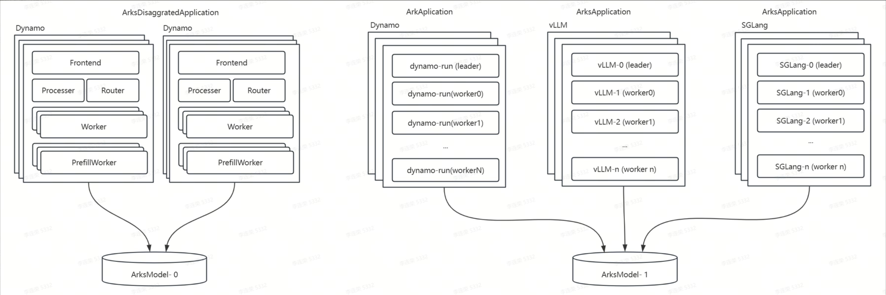

# Application Usage

## Overview

`ArksApplication` is a Kubernetes Custom Resource Definition (CRD) specifically designed for serving large language models (LLMs). It provides a simplified solution for users to deploy production-grade LLM services with a single command. Through high-level abstraction, it hides the complexity of the underlying infrastructure, allowing developers to focus on business logic rather than operational details. The overall architecture of ArksApplication is illustrated in the following diagram:



The core capabilities of `ArksApplication` include:
- Unified Multi-Runtime Interface: Seamlessly integrates with various high-performance inference runtimes without exposing runtime-specific complexities.
  - vLLM: Supports continuous batching and efficient memory management.
  - SGLang: Optimized for complex inference scenarios.
  - Dynamo: A dynamic computation graph execution engine.
- Support for Multiple Deployment Modes:
  - Multi-node Inference Deployment: Supports multi-node inference deployment for vLLM, SGLang, and Dynamo.
  - PD-Separated Inference Deployment: Supports Dynamo's parameter-server (PD) separated deployment mode.
- Horizontal Pod Autoscaling (HPA) Support:
  - Multi-node Inference Deployment: Supports SLO-based HPA.
  - PD-Separated Inference Deployment: Inherits HPA capabilities from Dynamo.
- Multi-model Deployment Support
- Heterogeneous Deployment Support
- Unified Metrics Interface

## Usage Guide

*Prerequisites*
- Ensure ArksModel is configured for preloading models (refer to the ArksModel Documentation for setup instructions).

### Deploying Multi-Node Inference Service (vLLM)
Below is a sample CRD for launching a distributed LLM inference service:
```
apiVersion: arks.ai/v1
kind: ArksApplication
metadata:
  labels:
    app.kubernetes.io/name: arks-operator
    app.kubernetes.io/managed-by: kustomize
  name: app-qwen-vllm
spec:
  replicas: 1
  tensorParallelSize: 2
  runtime: vllm
  # Optional, default to spec.model.name
  # servedModelName: qwen-7b
  model:
    name: qwen-7b
  instanceSpec:
    replicas: 2
    resources:
      limits:
        nvidia.com/gpu: "1"
      requests:
        nvidia.com/gpu: "1"
```

The meanings of ArksApplication-related parameters are as follows:
- `replicas`: Number of replicas for the LLM application service. In multi-node inference scenarios, each replica represents a group of multi-node LLM services.
- `driver`: Currently only supports LWS, defaults to LWS.
- `runtime`: Currently supports three runtimes: vllm, sglang, and dynamo; defaults to vllm.
- `runtimeImage`: Specifies the runtime image version. Defaults to the validated runtime version provided by Arks.
- `runtimeImagePullSecrets`: Used to specify private registry authentication information when the runtime image is stored in a private registry.
- `model`: Specifies the model to deploy
  - `name`: Specifies the name of the ArksModel for the LLM deployment.
- `servedModelName`: Specifies the model name exposed for external LLM service. Defaults to the name of the ArksModel.
- `instanceSpec`:
  - `replicas`: Specifies the number of nodes per LLM service group in multi-node inference scenarios.
  - `resources`: Specifies the resources for each LLM service node.
  - The following fields can be passed through to the underlying Kubernetes Pod:
    - `annotations`
    - `labels`
    - `env`
    - `volumeMounts`: The target mount path must not be /models.
    - `volumes`: Additional volumes can be mounted, but must not be named models.
    - `nodeSelector`
    - `affinity`
    - `schedulerName`
    - `tolerations`
    - `serviceAccountName`
- `tensorParallelSize`: Equivalent to the tensor-parallel-size setting in vLLM and SGLang.
- `extraOptions`: Used to specify extended runtime options, which can be passed through to the underlying runtime and must match the specified runtime.

View the status of the `ArksApplication`:

```
# kubectl get arksapplications app-qwen
NAME       PHASE     REPLICAS   READY   AGE
app-qwen   Running   1          1       17h
# kubectl get pods -l arks.ai/application=app-qwen
NAME           READY   STATUS    RESTARTS   AGE
app-qwen-0     1/1     Running   0          17h
app-qwen-0-1   1/1     Running   0          17h
```

The complete Status of the ArksApplication:

```
status:
  conditions:
  - lastTransitionTime: "2025-04-21T13:09:50Z"
    message: The application passed the pre-checking
    reason: PrecheckPass
    status: "True"
    type: Precheck
  - lastTransitionTime: "2025-04-21T13:12:09Z"
    message: The referenced model is loaded
    reason: ModelLoadSucceeded
    status: "True"
    type: Loaded
  - lastTransitionTime: "2025-04-21T13:12:09Z"
    message: The LLM service is running
    reason: Running
    status: "True"
    type: Ready
  phase: Running
  readyReplicas: 1
  replicas: 1
```

If the deployment fails, you can determine the reason based on the Status of the ArksApplication.

### Deploying Multi-Node Inference Service (SGLang)

You can refer to the following CRD template when deploying the model with SGLang:
```
apiVersion: arks.ai/v1
kind: ArksApplication
metadata:
  labels:
    app.kubernetes.io/name: arks-operator
    app.kubernetes.io/managed-by: kustomize
  name: app-qwen
spec:
  replicas: 1
  tensorParallelSize: 2
  extraOptions:
    - --mem-fraction-static
    - "0.7"
  runtime: sglang
  # Optional, default to spec.model.name
  # servedModelName: qwen-7b
  model:
    name: qwen-7b
  instanceSpec:
    replicas: 2
    resources:
      limits:
        nvidia.com/gpu: "1"
      requests:
        nvidia.com/gpu: "1"
```

Key modifications include:
- `runtime`: Set to sglang.
- `extraOptions`: Specify the size of the KV Cache pool to prevent GPU memory exhaustion due to excessive KV Cache usage.

### SLO-based HPA
Currently, `ArksApplication` is under development and testing for HPA-related functionalities.

## Planned Enhancements
The `Arks` project has completed validation of the Dynamo PD-separated inference deployment model. However, since the Dynamo project is still under active development, and the official stable Operator version has not yet been released, `Arks` does not currently support Dynamo PD-separated inference deployment. `Arks` will continue to monitor the progress of the Dynamo project and will support the Dynamo PD-separated deployment mode as soon as it becomes available.