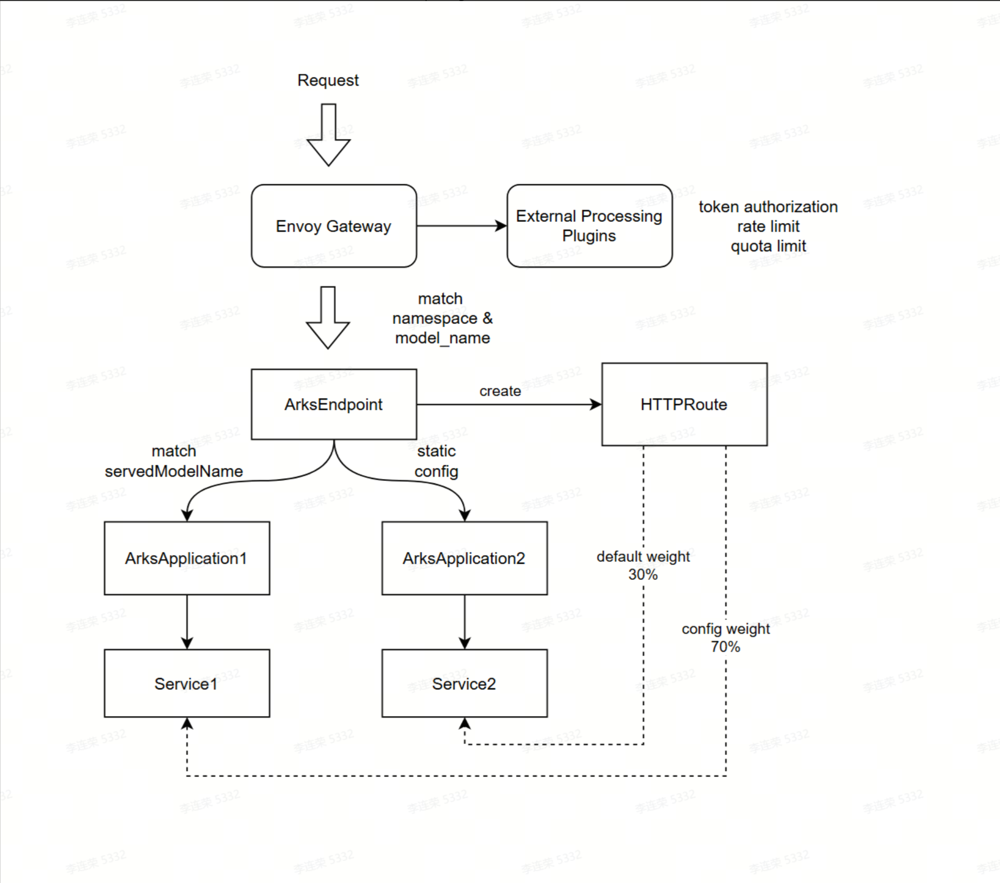

# Gateway Usage

## Overview
The Arks Gateway System is designed to serve as a multi-tenant, model-serving gateway with fine-grained token-based access control, quota management, and rate limiting. It is especially suitable for OpenAI-compatible APIs or any AI model-serving scenario requiring detailed usage tracking and routing control.
The system is built around three main concepts:
- `Token Management`: Each token defines the accessible models (ArksEndpoint), rate limits, and usage quotas. This enables secure and isolated access for different users or tenants.
- `Model Routing and Discovery`: ArksEndpoint maps user-facing paths (e.g., /v1/chat/completions) to internal model-serving services (ArksApplication), generating appropriate HTTPRoute to the Envoy Gateway.
- `Quota and Rate Enforcement`: Tokens are enforced with both rate limits (e.g., RPM, TPM) and quota checks (e.g., input/output/total tokens). These rules are processed by an external processor integrated with Envoy, allowing real-time enforcement and reporting.

All configurations are declarative, using Kubernetes Custom Resources (CRDs) to enable easy automation, GitOps workflows, and tenant-specific customization.

## Architecture & Concepts



- `Request Entry (Envoy Gateway)`: Incoming requests are routed through the Envoy Gateway, which delegates authentication, rate limiting, and quota enforcement to external processing plugins.
- `External Processing Plugins`: These plugins are responsible for:
  - Validating API tokens
  - Applying rate limits (e.g., RPM, TPM)
  - Enforcing quota limits (input/output/total tokens)
- `Endpoint Resolution (ArksEndpoint)`: After token verification, the request is matched against an ArksEndpoint using a combination of namespace and model_name. The ArksEndpoint defines:
  - Which models/applications can serve the request (ArksApplication)
  - Routing weights and logic (default vs. config-specified)
- `Application Routing (ArksApplication)`: ArksEndpoint selects one or more ArksApplication objects based on:
  - servedModelName (dynamic matching)
  - Static configuration
- Each ArksApplication is associated with a specific Kubernetes Service, which handles the actual request forwarding to model-serving backends.
- `HTTPRoute Generation`: Based on the routing configuration from ArksEndpoint, a HTTPRoute is dynamically generated and linked to Envoy:
  - Default backend weight (e.g., 30%)
  - Config-specified routing (e.g., 70%)

This enables:
- Blue-green deployments with weighted routing
- Multi-backend A/B testing
- Customizable model routing policies

## Usage Example

### ArksEndpoint
`ArksEndpoint` defines and manages routing rules for the API Gateway, dynamically mapping requests to backend services (ArksApplication) and generating a standardized HTTPRoute that binds to a pre-created Gateway.

```
apiVersion: arks.ai/v1
kind: ArksEndpoint
metadata:
  name: qwen-7b  # match ArksApplication.spec.servedModelName to dynamic discover
  namespace: tenant-a
spec:
  defaultWeight: 5
  gatewayRef:
    name: arks-eg
    namespace: arks-operator-system
  matchConfigs:
    - method: POST
      path:
        type: PathPrefix
        value: /v1/completions
    - method: POST
      path:
        type: PathPrefix
        value: /v1/chat/completions
  routeConfigs:
    - name: model-service-1
      port: 8080
      weight: 60
    - name: model-service-2
      port: 8080
      weight: 40
status:
  - name: model-service-1
    port: 8080
    weight: 60
  - name: model-service-2
    port: 8080
    weight: 40
  - name: model-service-3  # Dynamically discovered from ArksApplication
    port: 8080
    weight: 5
```

- `metadata.name`: must match the model name used in request body(OpenAI-compatible APIs ). This value maps to ArksApplication.spec.servedModelName or ArksApplication.spec.model.name.
- `metadata.namespace`: is used for tenant isolation.
- `spec.defaultWeight`: Default routing weight for dynamically discovered services.
- `spec.matchConfigs`: Defines the request matching rules (method + path).
- `spec.routeConfigs`: Statically configured backend services and their routing weights.
- `status`: Shows all active service endpoints (both static and dynamically discovered).

### ArksToken
Defines accessible endpoints, rate limit, and quota per token.
```
apiVersion: arks.scitix.ai/v1
kind: ArksToken
metadata:
  name: user1
  namespace: tenant-a
spec:
  token: "sk-xxxxxxxxxxx" # define your token
  qos:
    - arksEndpoint:
        name: qwen-7b
      rateLimits:
        - type: rpm
          value: 100
        - type: tpm
          value: 1000
        - type: tpd
          value: 10000
      quota:
        name: quota-qwen-7b 
    - arksEndpoint:
        name: deepseek-r1
      rateLimits:
        - type: rpm
          value: 200
        - type: rpd
          value: 2000
        - type: tpm
          value: 2000
      quota:
        name: quota-deepseek-r1
```

- `metadata.name`: Token identifier.
- `metadata.namespace`: Tenant namespace.
- `spec.token`: The actual token string used for authentication.
- `spec.qos`: List of QoS (Quality of Service) configs for different endpoints.
- `spec.qos[].arksEndpoint.name`: The target ArksEndpoint this config applies to.
- `spec.qos[].rateLimits[]`: A list of rate limit rules:
  - `type`: Limit type (rpm, tpm, rpd, tpd, etc.).
  - `value`: Numerical value for the limit.
- `spec.qos[].quota.name`:Reference to an ArksQuota object.
  
📌 `Note`: Multiple tokens can share the same quota.

### ArksQuota
Manages token usage quota.
```
apiVersion: arks.scitix.ai/v1
kind: ArksQuota
metadata:
  name: quota-deepseek-r1
  namespace: tenant1
spec:
  quotas:
    - name: prompt
      value: 1000
    - name: response
      value: 500
    - name: total
      value: 5000
status:
  quotaStatus:
    - name: prompt
      used: 250
    - name: response
      used: 125
    - name: total
      used: 375
```

- `metadata.name`: Quota name.
- `metadata.namespace`: Namespace for the quota.
- `spec.quotas[]`: List of defined quota items:
  - `name`: Quota type (e.g. prompt, response, total).
  - `value`: Max allowed usage.
- `status.quotaStatus[]`: Current usage per quota type:
  - `name`: Quota type.
  - `used`: Amount already used.

## Planned Enhancements
- Support for more flexible routing strategies, including dynamic load balancing.
- Auto-synchronization of routing rules when backend services scale up/down.
- Integration of circuit breaker mechanisms to automatically remove unhealthy backend services.