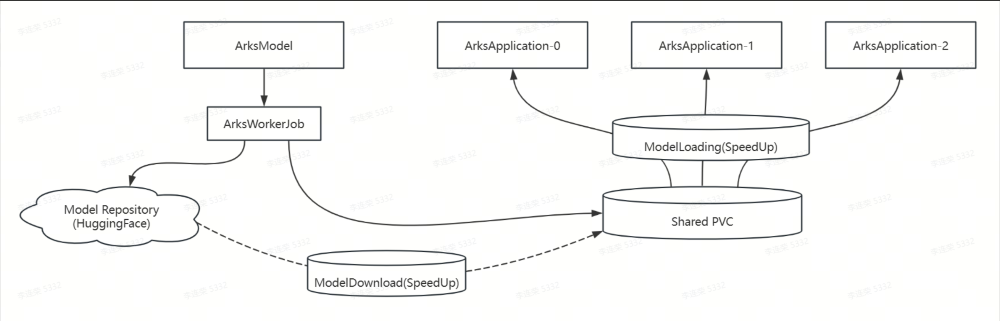

# Model Usage

## Overview
`ArksModel` is a solution designed to optimize the LLM model management workflow. It prepares models before GPU instance initialization and shares them with LLM application instances via high-performance shared storage. This significantly improves model loading efficiency during LLM application startup, thereby optimizing GPU resource utilization. The working principle is illustrated in the following diagram:



The controller executes the following workflow:
- Creates a storage volume based on the PVC specification defined in ArksModel.
- Starting a background workload to download the specified model into the storage volume.
- Syncing workload status to ArksModel.

## Usage Guide
Create a `ArksModel` to download model from HuggingFace:
```
apiVersion: arks.ai/v1
kind: ArksModel
metadata:
  name: qwen-7b
  namespace: default
spec:
  model: Qwen/Qwen2.5-7B-Instruct-1M
  source:
    huggingface: {}
  storage:
    pvc:
      name: qwen-7b
      spec:
        accessModes:
        - ReadWriteOnce
        resources:
          requests:
            storage: 30Gi
        storageClassName: local-path
```

Field specifications:
- `model`: Name of the source model to be downloaded, example: Qwen/Qwen2.5-7B-Instruct-1M
- `source`: The definition of model source
  - `Huggingface`: Download model from HuggingFace Hub
    - `tokenSecretRef`: References the HuggingFace authentication token secret
- `storage`: The definition of model storage
  - `pvc`: defines PVC storage for downloaded models
    - `name`: Defines the PVC name for model storage
    - `spec`: Defines the PVC specifications for the model storage, type `PersistentVolumeClaimSpec`

View the status of the ArksModel:
```
# kubectl get arksmodel qwen-7b
NAME      AGE   MODEL                         PHASE
qwen-7b   14h   Qwen/Qwen2.5-7B-Instruct-1M   Ready
```

The complete Status of the ArksApplication:
```
# kubectl get arksmodel qwen-7b -oyaml
...
status:
  conditions:
  - lastTransitionTime: "2025-04-21T13:09:50Z"
    message: Create model storage successfully(qwen-7b)
    reason: CreateSucceeded
    status: "True"
    type: StorageCreated
  - lastTransitionTime: "2025-04-21T13:12:08Z"
    message: Load the model successfully
    reason: ModelLoadSucceeded
    status: "True"
    type: ModelLoaded
  - lastTransitionTime: "2025-04-21T13:12:08Z"
    message: The model is ready now
    reason: Ready
    status: "True"
    type: Ready
  phase: Ready
```

If the `ArksModel` enters a Failed state, you can diagnose the issue by inspecting its Status.Conditions field.

### Preloading private models
To download private models with `ArksModel`, you must store your HuggingFace token in a Kubernetes Secret and reference it via tokenSecretRef. Below is a sample CRD for reference:

```
apiVersion: v1
kind: Secret
type: Opaque
metadata:
  name: hf-token
  namespace: default
data:
  HF_TOKEN: <HuggingFace token encoded by base64> # update HF token
---
apiVersion: arks.ai/v1
kind: ArksModel
metadata:
  name: qwen-7b
  namespace: default
spec:
  model: Qwen/Qwen2.5-7B-Instruct-1M
  source:
    huggingface:
      tokenSecretRef: hf-token
  storage:
    pvc:
      name: qwen-7b
      spec:
        accessModes:
        - ReadWriteOnce
        resources:
          requests:
            storage: 30Gi
        storageClassName: local-path
```

Or create the secret with the following command:

```
kubectl create secret generic hf-token --from-literal=HF_TOKEN=<HF_TOKEN>
```

### Storage Type Selection
`ArksModel` supports downloading models to any type of Persistent Volume Claim (PVC). However, the primary purpose of using PVCs is to accelerate model loading speed for subsequent GPU-based LLM application instances. Therefore, the appropriate storage type should be selected based on specific business scenarios.

#### Case 1: Deploying Multi-Node LLM Applications in On-Premises K8s Clusters
- Requirement: Models must be shared across multiple compute nodes.
- Recommended Storage:
  - NFS (Network File System) – Suitable for general shared access.
  - MinIO OSS (Object Storage) – Ideal for large-scale, distributed model storage.


#### Case 2: Deploying Multi-Node LLM Applications in Public Cloud K8s Clusters
- Requirement: High-performance, scalable shared storage.
- Recommended Storage (Cloud-Specific Options):
  - GPFS (IBM Spectrum Scale) – High-throughput parallel file system.
  - NAS/NFS – Managed network-attached storage (e.g., AWS EFS, Azure Files).
  - OSS (Object Storage Service) – Cost-effective for large models (e.g., AWS S3, Google Cloud Storage).
- Selection Criteria: Balance between performance (low-latency access) and cost.

### Case 3: Deploying Single-Node LLM Applications
- Requirement: Fast local access without multi-node sharing.
- Recommended Storage:
  - Shared Storage (NFS, OSS, etc.) – Ensures flexibility for future scaling.
  - Local-Path Provisioner – High-speed local storage (best for performance), but:
    - ❌ No failover support – Pods cannot migrate if the node fails.
    - ✅ Best for latency-sensitive, single-node deployments.


## Planned Enhancements
`ArksModel` will introduce the following optimizations to further improve model management efficiency:
1. Model Download Optimization
- Cluster-Level Model Caching:
  - Avoids redundant downloads of the same model across different workloads.
  - Accelerates download speeds by leveraging cached model layers/blocks.
  - Reduces egress bandwidth usage from IDC (Internet Data Center).


2. Model Loading Optimization
- Integration with open-source solutions，for example fluid, JuiceFS and so on. The expected benefits:
  - Faster LLM application startup (reduced model loading latency).
  - Improved GPU utilization (minimizes idle time waiting for model loads).