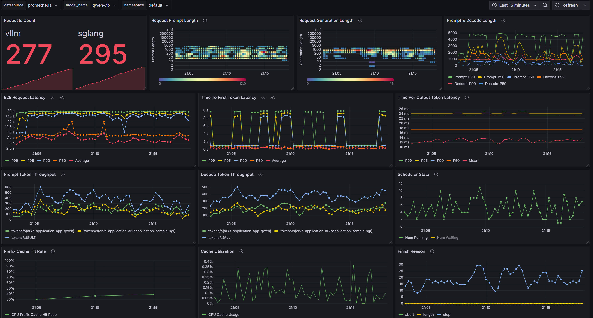

# Monitoring

This document describes how to monitor Arks using Prometheus and Grafana.

## Prerequisites

1. A Kubernetes cluster with Prometheus Operator installed
   ```bash
   # Install prometheus-operator using helm
   helm repo add prometheus-community https://prometheus-community.github.io/helm-charts
   helm repo update
   helm install prometheus prometheus-community/kube-prometheus-stack \
     --namespace monitoring \
     --create-namespace
   ```

2. Arks installed in your cluster

## Metrics Collection

Arks provides two types of metrics:
1. Runtime metrics from model serving
2. Gateway metrics from API gateway

### Runtime Metrics
Runtime metrics are collected from the model serving pods, including:

- Request Statistics
  - Success request count
  - Request prompt/generation length distribution
  - Request finish reasons (stop/length limit)

- Latency Metrics
  - End-to-end request latency (P50/P90/P95/P99)
  - Time to first token (P50/P90/P95/P99)
  - Time per output token (P50/P90/P95/P99)

- Throughput Metrics
  - Prompt token throughput
  - Decode token throughput
  - Number of running/waiting/swapped requests

- Cache Metrics
  - Prefix cache hit rate
  - Cache utilization (GPU/CPU)

### Gateway Metrics
Gateway metrics are collected from the gateway service, including:

- Request Processing
  - Request counts
  - Processing duration
  - Error counts

- Token Usage
  - Input/Output token counts
  - Token distribution

- Rate Limiting
  - Rate limit hits
  - Available tokens

- Quota Usage
  - Current quota usage
  - Quota limits

## Monitoring Setup

### ServiceMonitor Configuration

Arks automatically creates ServiceMonitor resources for both runtime and gateway services. You can find the configurations in:
```bash
config/prometheus/monitor-runtime.yaml  # For runtime metrics
config/prometheus/monitor-gw.yaml      # For gateway metrics
```

### Grafana Dashboard

Arks provides a pre-configured Grafana dashboard for visualizing the metrics:
```bash
config/grafana/runtime-dashboard.json
```

To import the dashboard:
1. Access your Grafana UI
2. Click "+" -> "Import"
3. Upload the dashboard JSON file or paste its content
4. Select your Prometheus data source
5. Click "Import"

## Dashboard Overview



The runtime dashboard includes several sections:

1. Request Overview
   - Success request count
   - Request prompt/generation length distribution
   - Token length percentiles (P50/P90/P99)

2. Latency Monitoring
   - E2E request latency
   - Time to first token
   - Time per output token
   - All metrics include P50/P90/P95/P99 percentiles

3. Throughput Analysis
   - Prompt token processing rate
   - Decode token processing rate
   - Per-instance and total throughput

4. Resource Utilization
   - Scheduler state (running/waiting/swapped requests)
   - Cache hit rates
   - Cache utilization

5. Request States
   - Number of running requests per instance
   - Number of waiting requests per instance

## Troubleshooting

Common issues and solutions:

1. Metrics not showing up
   - Check if ServiceMonitor is properly created
   - Verify Prometheus can access the metrics endpoints
   - Check pod labels match ServiceMonitor selectors

2. High latency
   - Monitor cache hit rates
   - Check number of waiting requests
   - Analyze token throughput

3. Low throughput
   - Check scheduler state
   - Monitor cache utilization
   - Analyze request distribution across instances


## TODO

* More metrics for gateway
* Gateway dashboard